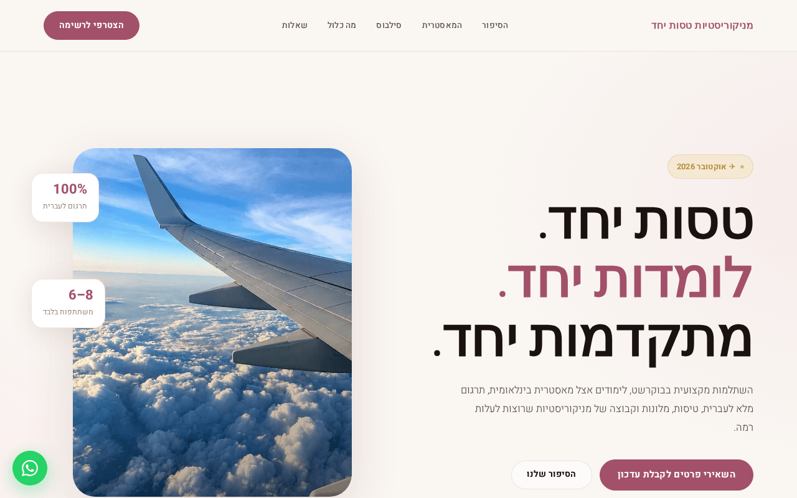
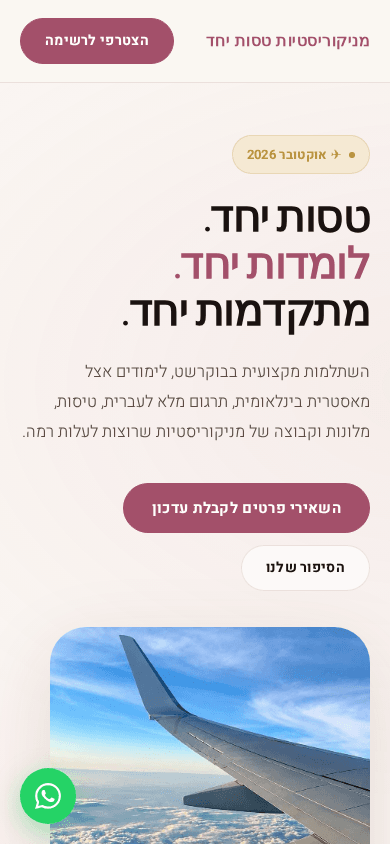
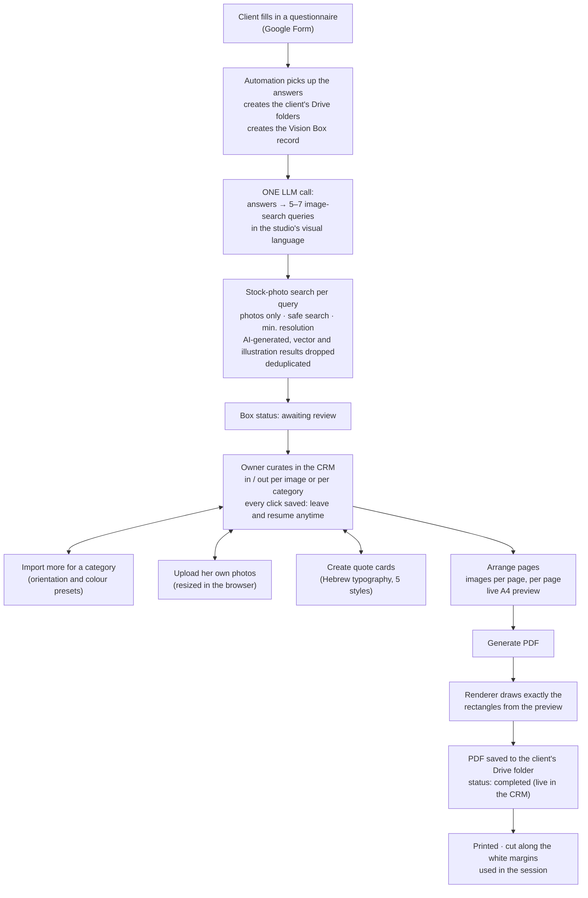

# MOR CRM — A Business System for a Beauty Studio, with the Vision Box

> **Portfolio showcase (client work).** This repository explains a system I designed and built
> for a small beauty business. It is mostly explanation, with a few short code excerpts. It is not
> the source code, it is not runnable, and it is not licensed for reuse. See [NOTICE.md](NOTICE.md).

A nail-artist and educator runs her studio, her professional training trips abroad and her
advertising from one place, **without needing a developer for day-to-day changes**. The system
has three parts that share one database:

1. a **CRM** where the owner works;
2. a **public landing page** whose content she edits herself;
3. the **Vision Box**, a guided mood-board service she delivers to her clients.

**Stack:** Supabase (Postgres + RLS, Edge Functions, Storage, Realtime) · vanilla JavaScript
(later ported to React / Next.js on a self-hosted API) · n8n · Python (reportlab) · LLM via
OpenRouter · Pixabay API · Meta Marketing API · Meta Pixel · Resend · Hebrew RTL

---

## The problem

A growing one-person business ends up running on memory and a messaging app. Clients, leads,
training trips, campaigns and ad spend all work up to a point, and then they stop working.

The usual fix makes it worse: a website one person can edit, a CRM another person can read, and
an ad account nobody reconciles with either. Every number exists twice, and the two copies
disagree.

**The design constraint that shaped everything:** the only user isn't technical, and she has no
patience for software. Anything that needs training fails on day two. Every screen was tested
against one question: *can this be used between two clients, on a phone, without thinking?*

## What the owner controls herself

| Area | What she can do | How it works |
|---|---|---|
| **Landing page content** | Edit the hero, story, syllabus, FAQ, lead form and popup of her training-trip page; upload images and set their focal point; preview; publish | Edits are saved as a **draft**. *Publish* copies a snapshot into a separate `published_content` column, which is the only thing the public page reads. *Preview* opens the real page with a one-time token and renders the draft on the server. |
| **Lead tracking** | See every lead, with source (main form or popup, plus ad UTM values), answers, repeat submissions and consent; move leads through a pipeline | Pipeline: *new → contacted → interested → waitlist → registered → paid / not relevant*. A repeat submission merges into the same lead instead of creating a duplicate. |
| **Contacts** | Keep the people relevant to each part of the business (clients, suppliers, instructors, …) with their role and links | Business areas are data. A contact can belong to several areas, with a different role in each. |
| **Mailing list** | Write a campaign (subject, intro, image, button, closing), choose a segment by trip and lead status, see the recipient count, send a test, then send | The recipient list is **always** intersected with active marketing consent **on the server**. Each send gets its own row, with delivery and open status fed back by webhook, and a personal unsubscribe link. |
| **Paid ads** | Create Meta campaigns, ad sets and ads from inside the CRM, with tracked links; view insights and billing | Goes through a single gateway (see *Security*). **Everything is created paused**, so going live is always a deliberate second step. |
| **Trips and trainings** | Manage dates, price, capacity, instructor and status (*draft → registration open → waitlist → closed → completed*) | A trip is also the landing page's content record, so there is one source of truth. |
| **AI usage and cost** | See every AI call by provider, model and workflow, and what it cost | Every automated workflow logs to one table, which also records whether each cost figure was reported by the provider or calculated. |

<p align="center">
  
  
  <br/><sub>The public landing page. Every word and image on it is edited from the CRM.</sub>
</p>

## The headline feature: the Vision Box

A **Vision Box** is a service the owner sells: a printed mood board built for one client. The
client fills in a questionnaire about who she is and what she wants. The owner curates imagery
that reflects it and hands over a printed board that the client cuts out and arranges in a
workshop.

The system turns what used to be hours of searching and layout work into roughly **choose →
arrange → print**.



The complete flow, step by step, is in **[docs/vision-box.md](docs/vision-box.md)**.

<p align="center">
  
  <br/><sub>A generated page (test box, stock imagery): A4 landscape, with white cutting margins around each image.</sub>
</p>

### Why it's built this way

- **One layout engine, not two.** The page geometry (A4 landscape, margins, gutters, cutting
  margins and a precomputed grid for 1–16 images per page) is defined **once**, in the CRM. The
  live preview is drawn from it, and the *same* rectangles are sent to the PDF renderer as a
  manifest. The renderer has no layout logic; it only draws what it receives. The printed result
  was measured to be within 0.09 mm of the preview.
  → [`vision-box-layout.js`](excerpts/vision-box-layout.js)
- **The server decides what gets drawn.** The browser sends candidate IDs and rectangles, never
  image URLs. The renderer looks the images up itself.
- **Images are cached, not hot-linked.** The stock provider's terms require downloading, and
  throttling had made a 98-image PDF take 7 minutes. A background queue in the CRM copies each
  selected image into storage while the owner is still curating.
- **Categories are derived, not configured.** An image's category is simply the search query that
  found it, so there is no category table to maintain.
- **Realtime without losing work.** Status changes patch the page in place, so a note the owner
  is typing survives a live update.
- **No text on the printed page**, not even the client's name, which appears only in the file
  name. That also removed a whole class of right-to-left rendering problems in PDF generation.

### The decision I'm proudest of: making it simpler

The first design was ambitious: a curated inspiration library searched with embeddings (RAG), a
"creative director" step, AI-generated images including one built from the client's photo, a
fixed curation of 35 images, and quote curation. That was eight stages.

When I checked the design against the running system, the picture was clear:

- the library it depended on was essentially empty;
- two of its stages had never been built;
- the CRM couldn't display what it produced;
- so it could not succeed on a single real client.

A much simpler flow (form → one LLM call → stock search → human curation → PDF) had already been
built and set aside. We chose to **replace** the ambitious design with it, and invested instead in
what the owner actually touches: curation, uploads, quote cards, the layout preview and a PDF that
matches it exactly.

The full reasoning is in [docs/vision-box.md](docs/vision-box.md#evolution). The lesson I took:
*a pipeline that can't finish is worth less than a simple one the user trusts.*

## Security

- **One public write path.** The landing page's lead form goes through an Edge Function with an
  origin allowlist, a honeypot field, phone normalization and an IP rate limit, and then one
  **atomic database function**. That function finds or creates the contact, tags it with the
  business area, upserts the lead, merges answers and records consent.
  → [`intake_submit_lead.sql`](excerpts/intake_submit_lead.sql)
- **The only anonymous read** is the published content of the featured trip. Everything else
  requires an active profile, enforced by row-level security on every table.
- **Tokens stay off the browser.** The Meta access token is stored in a table with RLS enabled
  and *no* policies, readable only by the gateway. The UI sees only a hint and an expiry date.
- **The ad gateway doesn't trust the platform's JWT check alone.** It turned out to accept the
  public key that ships to every browser, so the gateway verifies the user explicitly. Spending
  actions require an allowlisted user; *pause* is always allowed, because stopping spend should
  never be blocked.
  → [`meta-ads-gateway.ts`](excerpts/meta-ads-gateway.ts)
- **Consent is enforced on the server.** No client request can widen a campaign's audience beyond
  subscribed contacts.
- **Automation webhooks are authenticated with a shared secret**, and the stock-photo API key
  never leaves the server.

## Evolution and operations

- **Version 1** was a single static HTML file on Supabase: no build step, fast to change, easy to
  deploy.
- **Version 2** is a React / Next.js port running on the studio's own server, backed by MySQL. A
  small API reproduces exactly the database-client interface the app already used, so the app
  code barely changed. The new version was checked pixel-for-pixel against the old one, and the
  data migration was verified by checksums.
- Both versions ran side by side during the transition.

## Repository map

```
docs/
  vision-box.md               the full Vision Box flow, and how the design evolved
  features.md                 each owner-facing feature in more detail
excerpts/
  vision-box-layout.js        the single page-geometry definition and PDF manifest
  meta-ads-gateway.ts         the ad gateway's security model
  intake_submit_lead.sql      the atomic lead-intake function
screenshots/
```

## What is intentionally not here

The application code, the automation workflows, the schema, every client's and lead's data, the
owner's contact details, and all account identifiers and credentials.

---

Built by **Shalev Menachem** · [Portfolio](https://shalevpro.shalevmenahem.com/)
