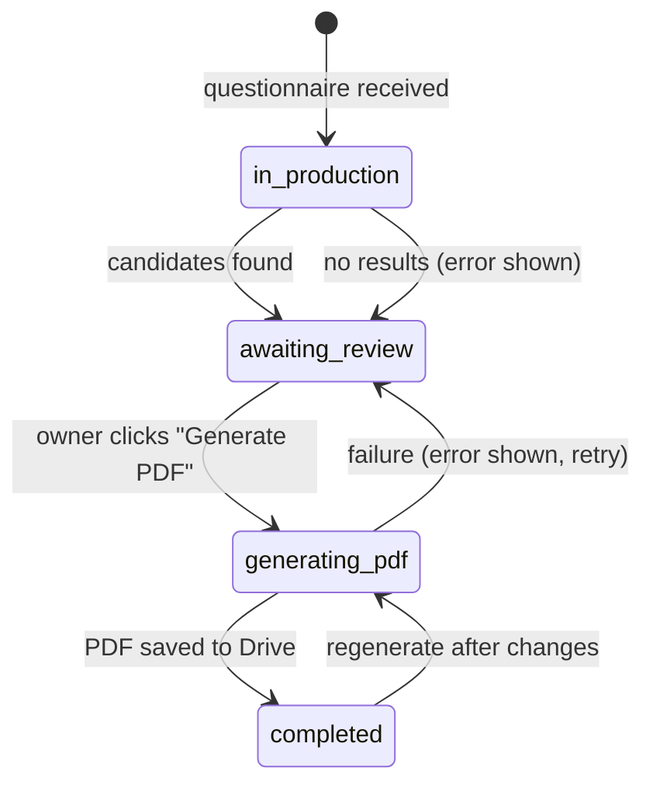

# The Vision Box, step by step

A Vision Box is a personal mood board: a printed set of images chosen to reflect one client, which
she cuts out and arranges during a session with the studio owner.

The system's job is to take the owner from *"a client answered a questionnaire"* to *"a
print-ready PDF"* with as little effort as possible, while leaving every creative decision to her.

## Who does what

| Actor | Role |
|---|---|
| **Client** | Fills in a questionnaire. That is all she ever touches. |
| **Automation (n8n)** | Picks up answers, prepares folders and records, finds candidate images, renders the PDF |
| **LLM** | Turns free-text answers into image-search queries (one call per box) |
| **Stock-photo API** | Supplies candidate images |
| **Owner (CRM)** | Curates, adds her own material, arranges pages, generates the PDF |
| **Supabase** | Database, storage, realtime updates, and the Edge Functions that sit between the CRM and the automations |

## The flow

### Phase 1 — Intake (automatic)

1. **The client answers a questionnaire.** The answers land in a spreadsheet, which an automation
   checks every minute.
2. **Folders are created.** Each client gets a Drive folder, with a sub-folder for the final
   deliverable.
3. **The box record is created** with status *in production*. The **entire** answer row is stored
   as structured data, so adding a question to the form requires no code change.
4. **One LLM call.** The answers go to a language model with a system prompt that describes the
   studio's visual language (warm, feminine, golden-hour, editorial). The model returns **5–7
   image-search queries**, each with an optional colour and category, as JSON that must match a
   schema. There is no image generation and no image analysis in this flow.
5. **Stock search and filtering.** For each query, the automation requests photos only, with safe
   search on, ranked by popularity, and at a minimum resolution. It then **drops anything tagged as
   AI-generated, vector or illustration**, keeps up to 24 results per query, and removes duplicates.
6. **Candidates are saved**, and the box moves to *awaiting review*. If nothing usable was found,
   the box records an explicit error instead of appearing empty.

### Phase 2 — Curation (the owner, in the CRM)

7. **Box list.** A card for each client shows a status chip, counts and a strip of preview images.
   Search, filters and sort order are remembered. The list refreshes in realtime, and boxes can be
   renamed or deleted (deleting also removes uploaded files).
8. **Client profile.** The box page opens with a *"who is the client"* panel that renders the
   questionnaire answers generically, hiding name, timestamp and photo. Next to it is a notes
   field that saves automatically.
9. **Board by category.** Images are grouped by the query that found them. Each image is in,
   out, or suggested (added later, not selected yet). A whole category can be selected at once.
   There is a full-screen viewer with keyboard navigation.
10. **Selection is optimistic and persistent.** The screen updates immediately, the change is
    written to the database, and it is rolled back if the write fails. Every click is saved, so
    the owner can stop between clients and pick up exactly where she left off.
11. **Import more.** A category that needs more options can fetch more, with orientation and
    colour presets. The request goes through an Edge Function to an automation, so the stock-photo
    key never reaches the browser. A per-category page cursor avoids repeats, and a unique index
    blocks duplicates. New images arrive as *suggested* and are never selected automatically.
12. **Her own photos.** The owner can upload images, which are resized in the browser before
    upload. If saving the record fails, the uploaded file is removed so nothing is left orphaned.
13. **Quote cards.** A small editor draws a quote on a 3:2 canvas in one of five styles, using
    fonts that render Hebrew properly. The card is saved as an image through the same upload path,
    in its own category.
14. **Background caching.** While she curates, a queue copies each selected stock image into the
    project's storage, two at a time, with retries and backoff.

### Phase 3 — Layout

15. **Pages.** The owner chooses how many images go on each page (1–16), either globally or page
    by page. A live, multi-page A4 preview shows exactly what will be printed.

    The geometry lives in one definition:
    - A4 landscape, 10 mm page margin, 8 mm gutter.
    - A white cutting margin around each image: 6 mm, capped at 12% of the cell so that small
      cells aren't swallowed.
    - A **precomputed** grid for every count from 1 to 16, chosen to keep cells close to the 3:2
      shape of a typical stock photo. It is fixed and readable, not a heuristic evaluated at
      runtime.

### Phase 4 — Output

16. **Generate PDF.** The CRM waits for the caching queue to finish, then sends a **manifest**:
    for each page, the candidate IDs and their exact rectangles, taken from the same function that
    drew the preview. The Edge Function:
    - validates the manifest (values between 0 and 1, and page and slot limits);
    - checks that the user is active;
    - refuses if a PDF is already being generated;
    - sets the box to *generating PDF*;
    - calls the automation with a shared secret, and rolls the status back if the automation
      can't be reached.
17. **Render.** The automation replies right away and works in the background:
    - it looks up each image's URL **itself**, preferring the cached copy, and never trusts URLs
      from the browser;
    - a Python renderer centre-crops each image into its rectangle, downsizes it to 300 dpi and
      compresses it;
    - the PDF is uploaded to the client's Drive folder, and the box is marked *completed*.

    If anything fails, the box returns to *awaiting review* with a visible error that offers
    *try again* and *dismiss*.
18. **Live result.** The CRM receives the status change in realtime and shows a link to the
    finished file. It patches the page in place instead of reloading it, so nothing the owner was
    typing is lost.
19. **In the session.** The owner prints the PDF. The client cuts along the white margins and
    builds her board.

## Status model

## Evolution

### The first design

The original plan was an eight-stage pipeline, triggered by an intake Edge Function that accepted
the answers and the client's photo:

1. An LLM builds a client profile.
2. Embeddings are created and **four RAG searches** run over a curated inspiration library.
3. A curator step selects **exactly 35** library images.
4. A "creative director" step writes prompts for AI-generated images, including one based on the
   client's photo, and a custom quote.
5. Library quotes are curated.
6. The plan is turned into image assets.
7. The owner selects and lays out.
8. The PDF is generated.

The plan was well thought through on paper. It even had a mock mode that let the whole database
round trip run without paid calls.

### What verification showed

Checking the design against the live system, rather than against its documents, showed that:

- the inspiration library held only a few test rows, and the curator step failed unless it
  returned exactly 35 images, so the pipeline **could not succeed on any real client**;
- stages 6 and 8 did not exist;
- the CRM had no screens for what the pipeline produced;
- every box in the system was test data.

### The decision

A simple flow (form → one LLM call → stock search → curation → PDF) had already been built
earlier and set aside. We decided to make it **the** design and to drop the library, RAG and
embeddings, the 35-image curation, AI image generation, the face image, the quote library, the
cover page and the reserve pool.

The effort went instead into the parts the owner actually uses:

- a board she can curate quickly and resume at any time;
- her own uploads and quote cards;
- control over the page layout;
- a PDF that matches the preview exactly;
- honest status and error reporting.

Dropping text from the printed page also removed the need for right-to-left text shaping in PDF
generation.

**What I took from it:** verify against the running system, not the plan. And when the elaborate
version can't finish, the simpler version the user trusts is the better product.
